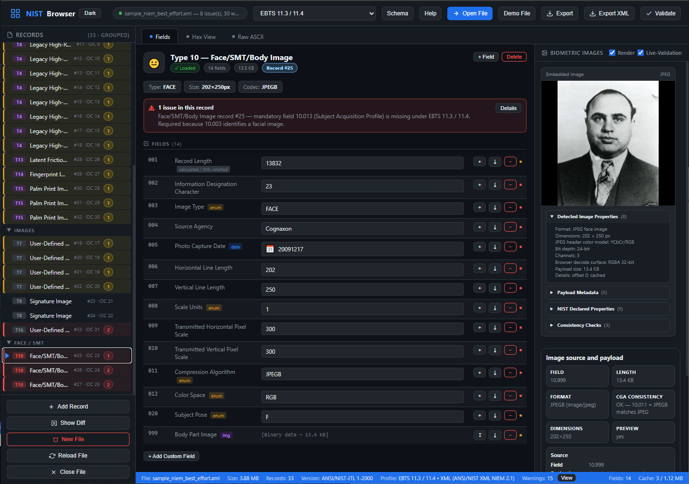
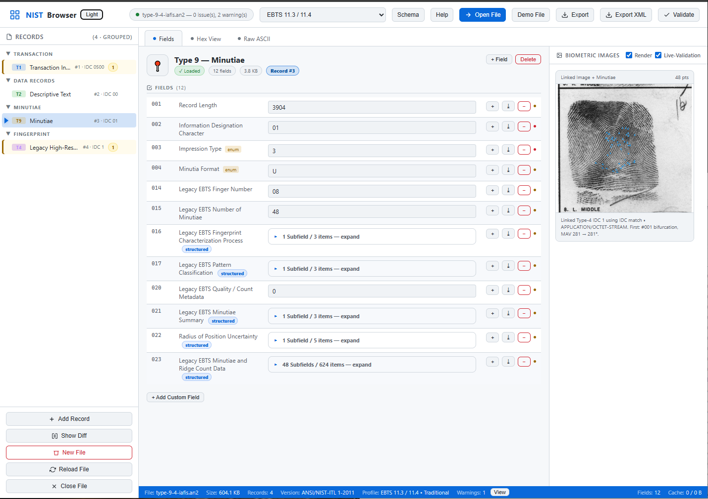
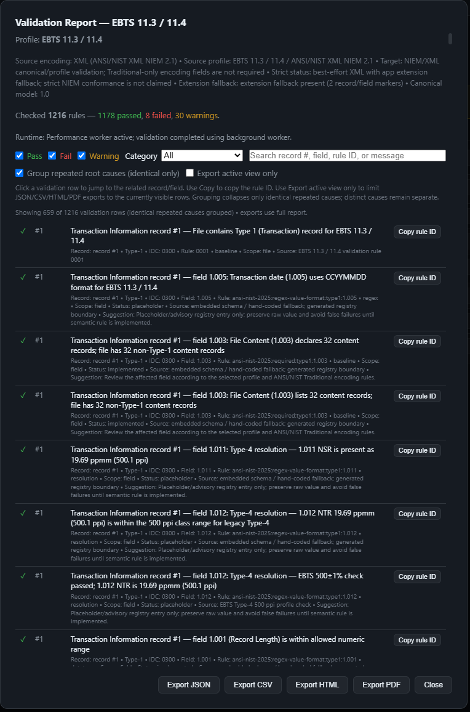
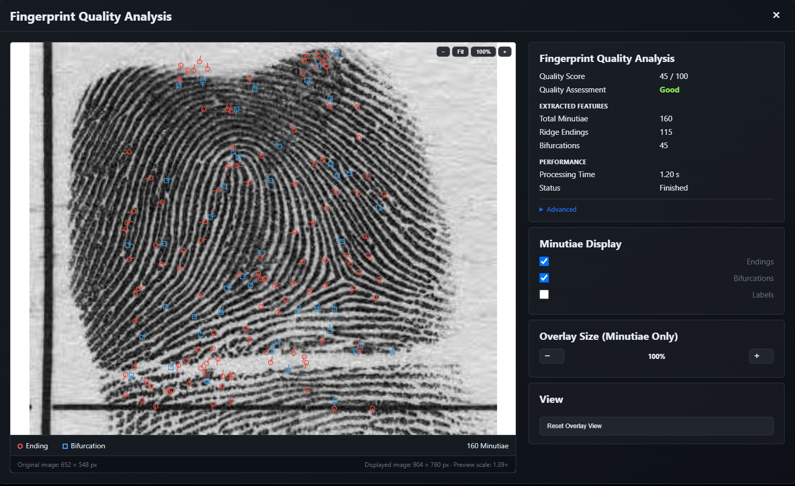
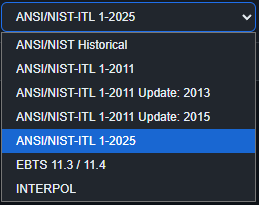
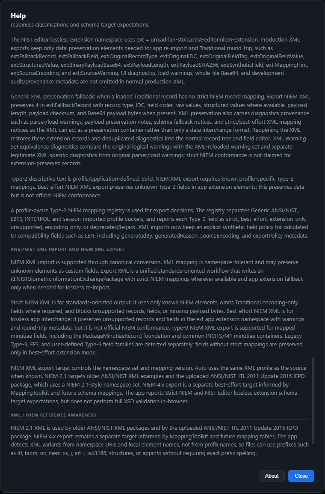
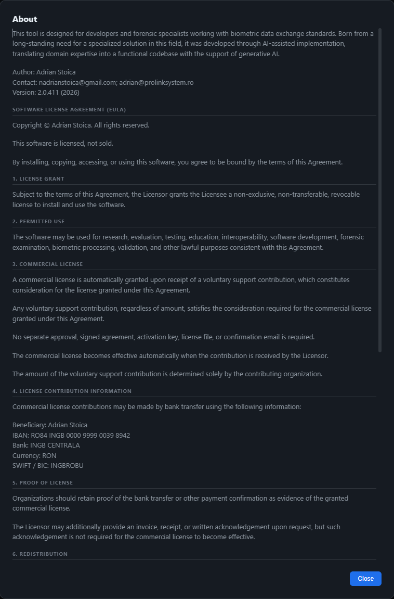

# NIST Editor


---

# Comprehensive ANSI/NIST Biometric File Viewer, Editor, Validator and Analysis Tool

**NIST Editor** is a professional Windows desktop application for viewing, editing, validating, converting and analyzing ANSI/NIST biometric files.

It has been designed for:

- Biometric software engineers
- AFIS developers
- Law enforcement agencies
- Border control systems
- Forensic laboratories
- Government agencies
- Biometric SDK vendors
- Researchers
- System integrators

The application focuses on **correctness**, **interoperability**, **standards compliance**, **lossless editing**, and **offline operation**.

---

# Live Demonstration

<p align="center">


</p>

*A short demonstration showing opening a NIST file, image preview, field editing, validation, and integrated NFIQ2 fingerprint quality analysis.*

---

# Main Features

## ANSI/NIST Traditional Support

✔ Open Traditional ANSI/NIST files

✔ Edit any supported record

✔ Byte-preserving binary payload handling

✔ Lossless Traditional → Traditional round-trip

✔ Automatic LEN/CNT regeneration

✔ Legacy separator preservation

✔ Variable-length and fixed-length record support

---

## XML Support

✔ Import ANSI/NIST XML

✔ Export ANSI/NIST XML

✔ Lossless XML round-trip

✔ Traditional ↔ XML conversion

✔ Preservation of binary payloads

---

## Standards-Aware Editing

Built-in knowledge of multiple biometric standards and implementation profiles.

Examples include:

- ANSI/NIST-ITL 1-2025
- ANSI/NIST-ITL 1-2011
- FBI EBTS
- INTERPOL
- Optional imported implementation profiles

Features include:

- automatic profile detection
- profile-specific validation
- schema-aware editing
- contextual hints
- code tables
- repair suggestions
- validation explanations

Optional implementation profiles can be imported without modifying the built-in standards.

---

# Supported Record Types

Supports editing and validation of numerous ANSI/NIST record types including:

- Type-1 Transaction Information
- Type-2 User Defined Text
- Type-3 Low Resolution Grayscale Fingerprint
- Type-4 High Resolution Grayscale Fingerprint
- Type-5 Low Resolution Binary Fingerprint
- Type-6 High Resolution Binary Fingerprint
- Type-7 User Defined Image
- Type-8 Signature Image
- Type-9 Minutiae
- Type-10 Facial / SMT Image
- Type-11 Voice
- Type-12 Dental
- Type-13 Latent Fingerprint
- Type-14 Tenprint Fingerprint
- Type-15 Palmprint
- Type-16 User Defined Testing Image
- Type-17 Iris
- Type-18 DNA
- Type-19 Plantar / Friction Ridge
- Type-20 Source Representation
- Type-21 Associated Context
- Type-22 Non-photographic Imagery
- Type-98 XML
- Type-99 CBEFF Biometric Data Block

---

# Image Support

Supports many biometric image encodings including:

- WSQ
- JPEG
- JPEG 2000
- PNG
- BMP
- TIFF
- JPEG-LS
- DICOM
- RAW raster formats

Capabilities:

✔ Automatic decoder detection

✔ Image metadata extraction

✔ Resolution verification

✔ Compression verification

✔ Preview generation

✔ Payload preservation

---

# Fingerprint Quality Analysis

Integrated **NFIQ2** quality analysis.

Features include:

- Quality score
- Quality assessment
- Fingerprint overlay
- Ridge endings
- Bifurcations
- Minutiae statistics
- Processing time
- Exported minutiae
- Overlay rendering

The overlay is rendered directly over the decoded image used for NFIQ2 processing.

---

# Validation Engine

The editor performs comprehensive validation including:

✔ Mandatory fields

✔ Field formats

✔ Numeric ranges

✔ Enumerations

✔ Compression algorithms

✔ Image metadata

✔ Resolution consistency

✔ DPI consistency

✔ CGA consistency

✔ Record relationships

✔ Cross-field validation

✔ Profile-specific validation

Validation messages include contextual explanations and repair suggestions where applicable.

---

# Image Preview

The integrated preview supports:

- automatic image detection
- metadata inspection
- safe payload preview
- DPI diagnostics
- compression diagnostics
- embedded decoder selection

Large binary payloads remain fully preserved.

---

# Type-12 Dental Support

Structured Traditional dental parsing including:

- dental history
- oral findings
- structured list handling
- image references
- payload preservation

JSON/XML dental payloads are safely preserved while providing secure preview capabilities.

---

# NFIQ2 Integration

Integrated NFIQ2 analysis provides:

- fingerprint quality score
- quality assessment
- extracted minutiae
- overlay visualization
- feature statistics
- CSV export
- overlay PNG export

---

# Privacy

**NIST Editor operates completely offline.**

No biometric records are transmitted to external services.

No cloud processing is required.

All decoding, validation and quality analysis are performed locally.

---

# Standards

The integrated Help contains references to major biometric standards including:

- ANSI/NIST-ITL
- FBI EBTS
- INTERPOL
- NIST Special Publications
- ISO biometric standards
- WSQ
- JPEG 2000
- JPEG-LS
- NIEM
- Additional reference documentation

---

# Windows Desktop

Public Windows releases are built using

- .NET 10
- Microsoft Edge WebView2

The HTML application is embedded inside the executable.

---

# Commercial License

This software is licensed, not sold.

Commercial use is governed by the End User License Agreement (EULA) included with the application.

A commercial license is automatically granted upon receipt of a voluntary support contribution, which constitutes consideration for the license granted under the EULA.

**Any voluntary support contribution, regardless of amount, satisfies the consideration required for the commercial license granted under this Agreement.**

Complete licensing terms are available in:

**Help → About → Software License Agreement (EULA)**

---

# Download

Download the latest Windows release from the **Releases** section.

```
NISTBrowserDesktop_WebView2_vXXX.zip
```

No installation is required.

---

# Documentation

The integrated Help includes documentation for:

- Supported record types
- Standards
- Profiles
- Validation rules
- Compression algorithms
- Image formats
- Fingerprint quality analysis
- Licensing

---

# Reporting Issues

Bug reports and feature requests are welcome.

When reporting issues please include:

- Application version
- Windows version
- Steps to reproduce
- Screenshots
- Sample file (if legally permissible)
- optional: JSON with the internal metadata. Go to Help / Developer diagnostics / Export Canonical Debug JSON metadata only

---

# Roadmap

Future development includes:

- Additional implementation profiles
- Enhanced XML interoperability
- Expanded dental support
- Improved comparison tools
- Additional image format diagnostics
- Continued standards alignment

---

# Screenshots

## Main Window

<p align="center">

</p>

---

## Image Preview

<p align="center">

</p>

---

## Validation

<p align="center">

</p>

---

## Fingerprint Quality Analysis

<p align="center">

</p>

---

## Schema Browser

<p align="center">

</p>

---

## Help

<p align="center">

</p>

---

## About

<p align="center">

</p>

---

# Copyright

Copyright © Adrian Stoica.

All rights reserved.
